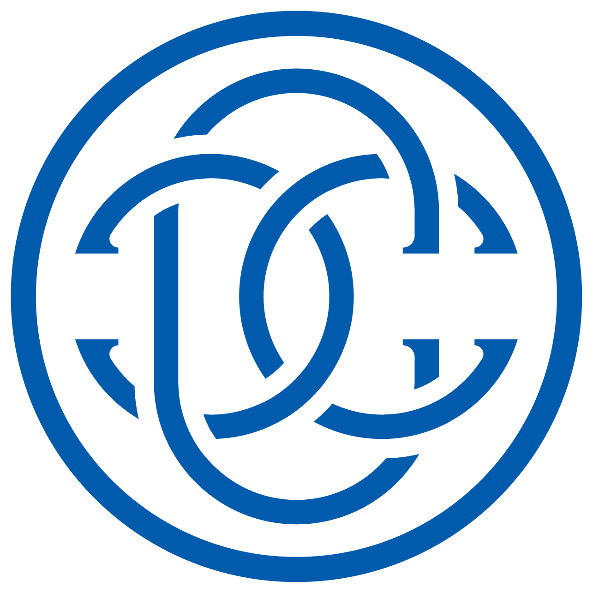

## About

<!-- プロフィール写真を入れる場合は、docs/images/profile.jpg を配置して下の行を有効化 -->  
<!--  -->
# 石川 麻衣子 (ISHIKAWA, Maiko)

グローバル技術と地域資源。
両面の立場で、異なる文脈をつなぐ実践と探究を行っています。

---
## Why

私は現在、

- システム開発支援（Contexture Lab.）
- 楮の栽培・加工・研究（えるあの葉）
    

という二つの活動を行っています。

一見すると異なる分野ですが、私にとってはどちらも「見えにくくなったつながりや文脈を理解し、つなぎ直すこと」を目指す実践です。

自動車会社に在籍中、業務フローの視点から"ものづくり"の現場を俯瞰する中で、複雑な分業化によって工程の前後関係やライフサイクル全体が見えにくくなっていることに課題感を抱くようになりました。

また、当時の企業の環境目標の多くは、負のインパクトを減らすことに重点が置かれていました。私は次第に、「何を減らすか」だけでなく、「人や地域、自然にどのような価値を生み出せるか」という、プラスのインパクトを伴う"ものづくり" (現在ではネイチャー・ポジティブという文脈で語られることが多い)へと関心を深めていきました。

その実践のために林業大学校で学び直し、探究を続ける中で、可能性の一つとして出会ったのが地域のバイオマス資源である楮でした。楮の生産地でベテラン農家のもと生産・加工に従事し、地域の指定管理事業の立ち上げ支援などを経験した後、現在は父から受け継いだ畑で楮を育てています。

この小さなフィールドを実践の「箱庭」とし、『ものが生まれ、やがて地球へ還るまで』というプロダクトライフサイクルや、人と自然とのつながりを自らの手で確かめながら探究しています。その学びや気づきを通して、消費や"ものづくり"の本質を次の世代へ伝えていくことを目指しています。

システム開発も地域資源活用も、私にとっては「つながり」を探究するための実践の場です。異なる領域を往復しながら、人・技術・地域・文化が本来持つ可能性を引き出す土壌を育てていきたいと考えています。

---
## Activities

-   { .logo-contexture }

    ### Side A: Contexture Lab. 
    **システム開発支援**

    システム開発における文脈を理解し、
    異なる専門性が交わる場で、
    より良いものづくりを支援します。

    **サービス概要**

    - 海外開発支援
    - 要件整理・仕様整理
    - 開発チームづくり支援

    **Links**

    - [note](https://note.com/mimio_white)
    - [X](https://x.com/mimio0910)

    **Contact**

    ✉ maiko@contexture-lab.com

    [Contexture Lab.について](contexture/overview.md){ .md-button }

-   { .logo-eru }

    ### Side B: えるあの葉 
    **楮の栽培・加工・研究**

    楮の栽培・加工・研究を通じて、
    地域資源と伝統文化の持続可能な活用を探究しています。

    **サービス概要**

    - 楮栽培・加工・研究
    - 地域資源活用
    - 物質循環・生物多様性・環境教育

    **Links**

    - [note](https://note.com/frond_of_eru)
    - [X](https://x.com/craft_farm_eru)

    **Contact**

    ✉ contact@craft-eru.com

    [えるあの葉について](eru/concept.md){ .md-button }

---

## Career

システム開発・プロダクト開発・海外開発支援に関する経歴はこちら。

[職務経歴書を見る](./contexture/resume.md)