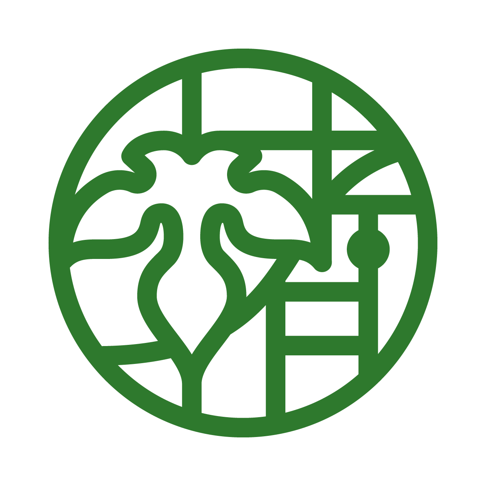

# Maiko Ishikawa

グローバル技術と地域資源、両面の立場で、異なる文脈をつなぐ実践と探究を行っています。

## A面: Contexture Lab.

グローバルなメンバーの調整役として、システム開発における認識のズレやコミュニケーションギャップを整理し、チームが価値を生み出しやすい環境づくりを支援しています。

[Contexture Lab.について](./contexture/overview.md)

## B面: えるあの葉

楮の栽培・加工を通じて、地域資源と伝統文化の持続可能な活用を探究しています。

[えるあの葉について](./eru/concept.md)

## Career

[職務経歴書](./career/resume.md)